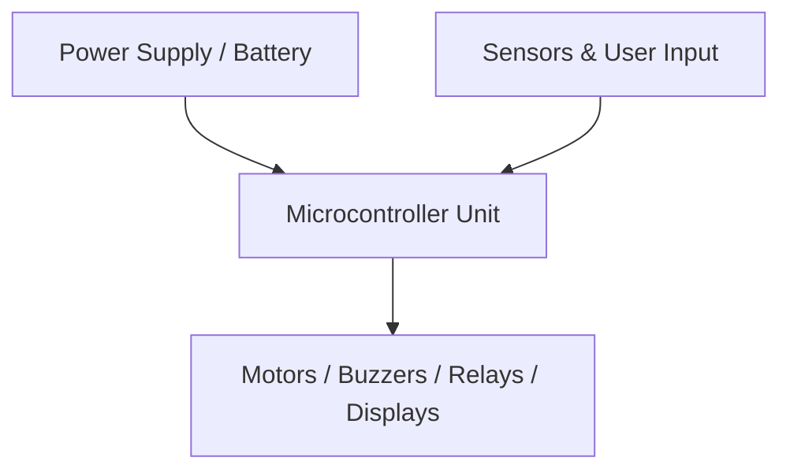

# Autonomous & Bluetooth Controlled 4-Wheel Robot Car 🚗🤖 - Technical Design & Circuit Architecture

## Hardware Components (BOM)
- Arduino Uno R3
- L298N Dual Motor Driver
- 4x TT Gear Motors (6V)
- HC-05 Bluetooth Module
- HC-SR04 Ultrasonic Sensor
- 2x 18650 Li-ion Batteries

## System Capabilities
- Wireless Bluetooth Teleoperation via Smartphone App
- Autonomous Ultrasonic Collision Avoidance
- Dual H-Bridge Differential Steering Control
- Robust Power Regulation Circuitry
